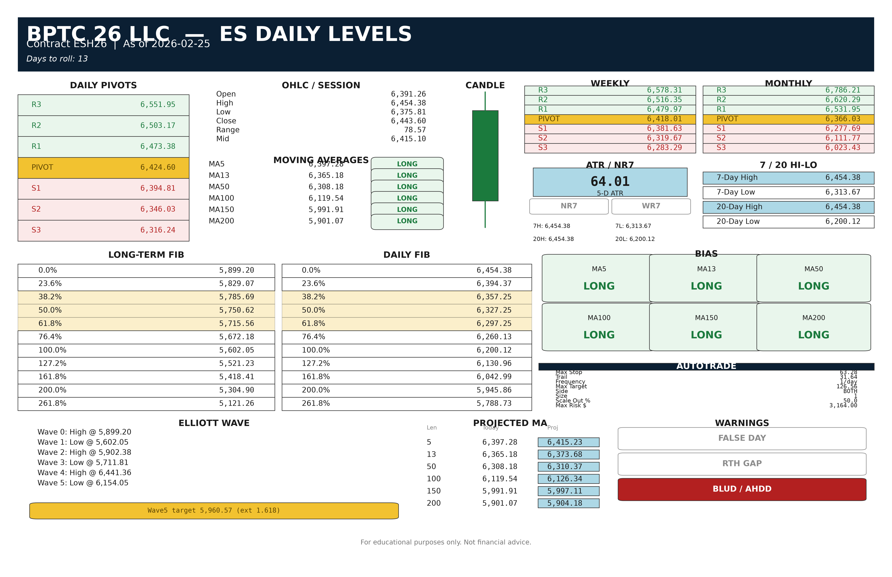

# LevelSheet

CME/CBOT/NYMEX/COMEX futures **daily levels sheet** generator — print-ready 300 DPI PNG and US-Letter-landscape PDF.



## Table of Contents

1. [Overview](#overview)
2. [Install](#install)
3. [Quick Start](#quick-start)
4. [CLI](#cli)
5. [GUI](#gui)
6. [Phone & desktop access](#phone--desktop-access)
7. [Configuration](#configuration)
8. [Cloud Agents](#cloud-agents)
9. [Docker](#docker)
10. [Development](#development)
11. [Architecture](#architecture)
12. [License](#license)

## Overview

Given any futures root (ES, NQ, CL, GC, SI, ZB, 6E, RTY, …) and a trading date, LevelSheet computes institutional prop-style daily levels (classic/Camarilla/Woodie pivots, Fibonacci, MAs + bias, ATR, NR7/WR7, Elliott projection, autotrade sizing, warning flags) and renders a single-page color-coded sheet.

Providers (ordered): **Polygon** (if `POLYGON_API_KEY` set) → **yfinance** (always) → **Interactive Brokers** (optional, lazy).

## Install

```bash
git clone <repo-url> levelsheet && cd levelsheet
python -m venv .venv && source .venv/bin/activate   # Windows: .venv\Scripts\activate
pip install -e ".[dev]"
cp .env.example .env   # then add POLYGON_API_KEY=...
make test-cov          # confirm >=90% coverage, all green, zero lint/type errors
python -m levelsheet generate ES --date 2026-08-12 --format pdf,png
# → output/pdf/ES_2026-08-12.pdf and output/png/ES_2026-08-12.png, generated in under 10 seconds
make run-gui
# → http://localhost:8501
```

## Quick Start

```bash
python -m levelsheet generate ES --date 2026-08-12 --format pdf,png
python -m levelsheet generate ES NQ CL GC --date 2026-08-12 --format pdf --batch
python -m levelsheet book --date 2026-08-12 --symbols ES,NQ,CL,GC --output output/pdf/full_book_2026-08-12.pdf
python -m levelsheet cache refresh --symbol ES --interval 1d
python -m levelsheet config show
```

## CLI

| Command | Purpose |
|---------|---------|
| `generate SYMBOLS...` | Render PDF/PNG for one or more roots |
| `book --symbols A,B --output PATH` | Multi-page PDF book |
| `cache refresh --symbol ROOT` | Force-refresh Parquet cache |
| `config show` | Dump merged JSON config |

Global `--debug` re-raises with full traceback.

## GUI

```bash
make run-gui
# → http://localhost:8501
```

Sidebar: symbol picker / custom root, date, pivot method. Tabs: Single Sheet (PNG preview + PDF/PNG download) and Full Book. Works on desktop and mobile browsers.

Optional lock for public hosts: set `LEVELSHEET_PASSWORD` in `.env` or Streamlit secrets.

## Phone & desktop access

Cursor Cloud Agents are for building — not a stable URL for your phone. Host the Streamlit GUI once, then open the same link on iPhone Safari and desktop Chrome.

### Fastest public URL (Streamlit Community Cloud)

1. Merge this repo to `main` (or deploy from a branch).
2. Go to [share.streamlit.io](https://share.streamlit.io) → sign in with GitHub.
3. **New app** → repo `marinerxcapital/levelsheet` → branch `main` →
   Main file `src/levelsheet/gui/streamlit_app.py` → **Deploy**.
4. In App settings → Secrets, add:

```toml
LEVELSHEET_PASSWORD = "choose-a-shared-password"
POLYGON_API_KEY = "optional"
```

5. Open the `*.streamlit.app` URL on your iPhone and desktop. On iOS: Safari Share → **Add to Home Screen**.

`packages.txt` and `.streamlit/config.toml` are already in the repo for Community Cloud.

### Private URL (recommended for trading tools)

Run Docker on any always-on machine, then expose only to you:

```bash
docker compose up -d
# then Cloudflare Tunnel or Tailscale Serve → https://levelsheet.your-domain
```

Same password env var works: `LEVELSHEET_PASSWORD=...` in `.env`.

## Configuration

Merge order (lowest → highest precedence):

1. Built-in `LevelSheetConfig` defaults
2. Packaged `src/levelsheet/config/default_config.yaml`
3. `~/.levelsheet/config.yaml` (optional)
4. `./levelsheet.yaml` (optional)
5. CLI nested dict overrides
6. `LEVELSHEET__*` environment variables (e.g. `LEVELSHEET__THEME__BULLISH=#00FF00`)

Theme hex codes, MA lengths, ATR length, branding, and cache staleness are all overridable without code changes.

## Cloud Agents

Cursor Cloud Agents boot from `.cursor/environment.json`:

- **install** — `pip install -e ".[dev]"`, create dirs, warm Parquet cache via `scripts/bootstrap_cache.py`
- **start** — Streamlit GUI on `0.0.0.0:8501` (headless)

Optional secrets (set in the Cloud Agent environment / `.env`):

| Secret | Required | Purpose |
|--------|----------|---------|
| `POLYGON_API_KEY` | No | Primary market-data provider |
| `IB_ENABLED` | No | Set `true` only with a reachable TWS/Gateway |

Nightly cache warming also runs via `.github/workflows/cache-bootstrap.yml` (weekdays 06:00 UTC + manual dispatch).

```bash
make bootstrap-cache   # pre-warm cache/{root}/{1d,1wk,1mo}.parquet
make run-gui           # http://localhost:8501
```

## Docker

```bash
cp .env.example .env   # set POLYGON_API_KEY if desired
docker-compose up
# → http://localhost:8501
```

## Development

```bash
make lint          # ruff
make format        # black + ruff --fix
make typecheck     # mypy --strict
make test-cov      # pytest with >=90% coverage
```

CI runs the same gates on every push (see `.github/workflows/ci.yml`).

Agent judgment calls are logged in [`DECISIONS.md`](DECISIONS.md).

## Architecture

```
src/levelsheet/
  calc/       # pivots, fib, MA, ATR, Elliott, flags, autotrade
  data/       # providers, cache, roll calendar, continuous contracts
  render/     # 80×120 GridSpec layout, panels, PNG/PDF exporters
  config/     # pydantic schemas + YAML/env merge loader
  cli/ gui/   # argparse CLI + Streamlit app
  pipeline.py # end-to-end generate/export orchestration
```

## License

Proprietary — BPTC 26 LLC. For educational purposes only. Not financial advice.
